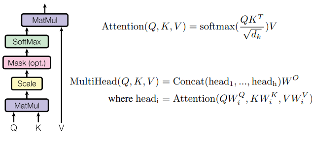
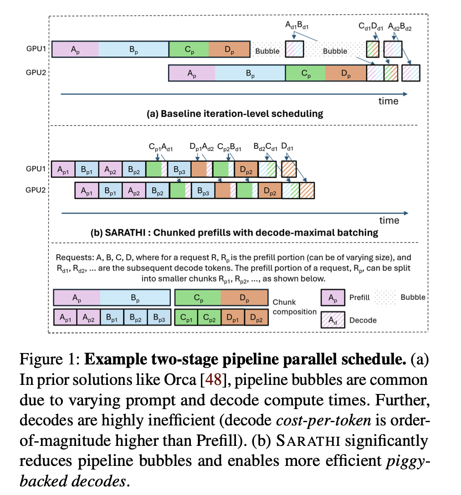

# Mini-SGLang的调度器

## 背景

mini-sglang是sglang的一个教学版本实现，旨在让更多的人能够接触到sglang推理框架学习其基本原理。sglang并不是第一个弄出此类青春教育版推理框架的团队，早在2025年，vLLM团队就弄出了nanovLLM。同时社区也有很多人贡献了自己的nano或者mini的项目，用来进行简便的学习

本文通过对mini-sglang调度器的解析，帮助读者在阅读真实sglang代码之前先建立整体性的框架认知。文章共分为四个部分：

1. **AR推理的计算特性**：prefill与decode为何是两种截然不同的计算模式
2. **KV Cache的碎片化挑战**：朴素的连续分配策略为何难以规模化
3. **两大解决方案**：Paged Attention如何消解碎片、Chunked Prefill如何平滑延迟抖动
4. **mini-sglang的调度器实现**：逐函数拆解调度循环、批次决策与元数据准备

尽管这些问题在2026年来看都很基础，但若对这些概念仍然模糊，你会难以把握sglang框架的核心，进而妨碍后续的深度学习。

### prefill和decode的计算差异问题

我们都知道，transformer计算的公式为：

从这个公式出发，我们建立了一种自回归，也就是auto regressive的范式。这套范式利用一个长度为N的sequence里的最后一个token $x_{N - 1}$ 对应从模型中得到的概率分布，来预测下一个token。

因此，在所谓“推理”，也就是模型得到一个长文本$p$来获得输出的时候，我们需要：
1. 把$p$里所有的token $x_0, x_1, ..., x_{N - 1}$ 对应的Q、K、V状态矩阵全部算出来，来得到下一个token的概率分布，从而得到新的token $x_N$。
2. 把 $x_N$ 和已经得到的 $p$ 拼接在一起，因为此时我们已经有0到$N-1$号token全部的Q K V状态，所以我们只需要把$x_N$对应的Q、K和V算出来，就可以得到用来预测 $x_{N + 1}$的概率分布。

就此，我们可以发现很大的差异：上述的1过程，我们需要花费大量的时间把整个序列的QKV矩阵全部给算出来，而访存的压力并不大；而2过程反过来，尽管只需要计算新产生token的QKV，但是由于之前sequence产生了一个比较大的QKV矩阵，因此此时反而是访存压力大。很明显，这两个计算方法之间有着很大的差异性。

上面的1，也就是所谓的prefill，而2就是decode。因此我们可以看到，1和2的工作流程是有着很大的差异的。

### KV Cache的碎片化问题

而KV Cache本身其实也是一个比较简单的概念，就是我们上面说的”把算出来的历史K和V”存起来的机制。至于为什么不存Q，原因在于：decode阶段只有**新**token的Q参与attention计算（它要去查询所有历史K/V），历史token的attention已在之前的iteration中完成，其Q值此后不再被使用，自然无需缓存。

所以我们得到了一个比较简单的范式：对于一个传来的请求$q$，我们可以很简单的预留prompt长度+预期产生的最多token长度对应的tensor用作kv cache，然后推理的时候按需存取即可。这个方法虽然简单，但其实会产生非常严重的碎片化问题影响memory的复用，尤其结合2026年各种内存价格飙升的消息，这么简单的实现确实很不中用。[vLLM](https://arxiv.org/pdf/2309.06180)的文章里详细论述了这个问题，在此不再赘述。

因此我们发现，想要设计一个好的llm推理框架，首当其冲就是KV Cache管理问题和prefill和decode的差异。当然prefill和decode的差异不止有马上要讲的scheduler的简单控制，还有一些比较复杂的infra方法，待之后有机会的话可以再讲。

## 解决方案

为了解决上面的问题，实际上已经有非常多成熟的解决方案了。

### Paged Attention

借鉴操作系统里管理页表的思想，我们也可以把KV Cache视作一种人需要重点管理的GPU内存资源，做到给每个request实现按需分配和定时回收，同时由于采用了页表作为映射的方式，我们可以灵活地映射逻辑内存和物理内存，这样也避免了内存碎片化的问题，提升了内存利用率

当然还有一个好处是，由于建立起来了token和kv的映射关系，因此我们也可以灵活复用已有sequence前缀的KV Cache，从而提高推理效率。这也是sglang的一个重点创新，也就是Radix Cache。

### Chunked Prefill

前面的论述里，我们发现了一个基本的问题：prefill是compute-bound，decode是memory-bound。现在问题来了：当调度队列里同时存在等待prefill的新请求和已经在decode的老请求，每一个iteration该怎么分配？

朴素的答案是"prefill优先"——先把新来的请求全部prefill完，再去推进decode。这在请求都很短的时候没问题，但一旦遇到长prompt就会出麻烦，具体麻烦在哪里，请看下图：

我们不妨把上面的图具体化到这个场景：队列里有一个1024 token的长prompt等待prefill，同时有32个正在decode的请求。采用prefill优先策略，这32个decode请求在那1024 token的prefill iteration完成之前，一个新token都吐不出来——整整被stall一个iteration。LLM推理有一个用户体验指标叫做**TPOT（time per output token，每个输出token的延迟）**，在这种情况下TPOT会出现明显的抖动峰值，用户侧感知到的就是"突然卡了一下"。

Chunked Prefill的思路是把这个长prefill切碎。设定一个`chunk_size`（比如512），每个iteration不再一次性处理完整的1024 token prefill，而是只处理一个512 token的chunk。更进一步的做法是**把等待decode的请求也放进同一个iteration的batch里一起做forward pass**，使两类计算在GPU上交错进行。这样，1024 token的长prompt需要两个iteration完成prefill，但这两个iteration中decode请求也在同步推进，TPOT的抖动被显著压平了。

> 不过有一个小问题：mini-sglang为了教学简洁性，并未实现上述"prefill+decode混合batch"的能力——调度器每个iteration只处理纯prefill批次或纯decode批次（见后文代码分析）。此处描述的是完整的Chunked Prefill概念，包括真实sglang中的实现思路。

SGLang里把这种"在已有KV Cache前缀基础上做增量prefill"的操作叫做**extend**——它和完整的prefill本质上是同一个操作，只是输入的token序列变成了某个chunk而非完整prompt。调度器的职责之一，就是决定每个iteration里哪些请求走extend、哪些请求走decode，以及extend的chunk_size是多少。

这里有一个trade-off值得点出：`chunk_size`越小，decode延迟越平滑，但prefill被切成更多碎片，每次extend都有固定的调度和KV Cache写入开销，总的prefill吞吐量会下降。Chunked Prefill本质上是**以少量prefill吞吐量换取decode延迟平滑性**的经典工程权衡，是现代推理框架调度器的标配设计。下文分析scheduler代码时会具体展示这个调度逻辑如何实现。

## mini-sglang的实现

有了上面的理论基础，我们可以好好来看一看mini-sglang的调度器是如何实现的了。请注意以下代码均基于 commit `20fcd7f`。

### 大体架构

scheduler的循环主体（[`scheduler.py:83-118`](https://github.com/kawaruko/mini-sglang/blob/20fcd7f/python/minisgl/scheduler/scheduler.py#L83)，`overlap_loop` / `normal_loop`）在每个iteration里依次做四件事：

1. **接收并处理消息**：调用 `self._process_one_msg()` 处理来自tokenizer worker的 `UserMsg`。注意此时 `input_ids` 已由上游的tokenizer worker完成分词，`_process_one_msg()` 本身只做三件事：校验序列长度是否超过模型上限、按需裁剪 `max_tokens`、将请求加入 prefill 等待队列（[`scheduler.py:169-198`](https://github.com/kawaruko/mini-sglang/blob/20fcd7f/python/minisgl/scheduler/scheduler.py#L169)）。
2. **调度并准备批次**：调用 `self._schedule_next_batch()`，它内部先调用 `prefill_manager` 尝试组一个 prefill batch，若无可调度的 prefill 请求才退而求其次调用 `decode_manager`（[`scheduler.py:219-225`](https://github.com/kawaruko/mini-sglang/blob/20fcd7f/python/minisgl/scheduler/scheduler.py#L219)）。确定好 batch 后，再调用 `_prepare_batch()` 构建元数据（详见后文）。
3. **模型前向计算**：调用 `self._forward()` 将准备好的批次送入推理引擎，执行 forward pass 并将采样到的新 token 写回 token pool（[`scheduler.py:227-233`](https://github.com/kawaruko/mini-sglang/blob/20fcd7f/python/minisgl/scheduler/scheduler.py#L227)）。
4. **处理上一批次的结果**：调用 `_process_last_data()` 同步 GPU→CPU 拷贝、拼接输出 token、判断是否结束，并将结果发回 tokenizer worker（[`scheduler.py:138-167`](https://github.com/kawaruko/mini-sglang/blob/20fcd7f/python/minisgl/scheduler/scheduler.py#L138)）。

> 在 overlap 模式下，步骤 3（当前批次的 GPU 计算）与步骤 4（上一批次的 CPU 结果处理）会利用不同的 CUDA stream 并行执行，以此隐藏 CPU 侧的处理延迟。

因此，调度逻辑的核心在 `_schedule_next_batch()` 中：**优先 prefill，无 prefill 才 decode**，两者不会出现在同一个 batch 里。

### prefill/decode

由 `_schedule_next_batch()` 中一行 Python `or` 表达式（[`scheduler.py:221-224`](https://github.com/kawaruko/mini-sglang/blob/20fcd7f/python/minisgl/scheduler/scheduler.py#L221)）确定本次 iteration 的类型：**prefill 优先，且两者互斥**。mini-sglang 目前不支持 prefill+decode 混合 batch，大概是出于框架的简洁性考虑。

#### Prefill Manager 的任务

`PrefillManager.schedule_next_batch()` 遍历等待队列，对每个请求调用 `PrefillAdder.try_add_one()` 尝试加入本次 batch（[`prefill.py:126-151`](https://github.com/kawaruko/mini-sglang/blob/20fcd7f/python/minisgl/scheduler/prefill.py#L126)）。判断与分配逻辑分为两条路径：

**路径 A：全新请求（首次进入调度）**

调用 `_try_allocate_one()`（[`prefill.py:39-63`](https://github.com/kawaruko/mini-sglang/blob/20fcd7f/python/minisgl/scheduler/prefill.py#L39)）：
1. 检查 table slot 是否充足（一个 slot 对应一行页表）
2. 在 Radix Cache 中查找该请求的前缀匹配（`cache_manager.match_req()`）
3. 估算所需 KV Cache 空间：`extend_len + output_len`，并与正在 decode 的请求所预留空间相加，确认内存足够
4. 分配 table slot，若存在前缀命中（`cached_len > 0`），将匹配前缀的**物理页索引**和对应 **token IDs** 复制到新的 table slot——这就是 Radix Cache 发挥作用的地方

随后调用 `_add_one_req()` 计算本次的 `chunk_size = min(token_budget, remain_len)`，若 `chunk_size < remain_len` 则将请求封装为 `ChunkedReq`，表示本次 iteration 只处理了部分 token，下次还需继续。

**路径 B：续传 chunk（已被切片、等待继续）**

若请求的 `pending_req.chunked_req` 字段不为空，说明上一个 iteration 已为它分配好 `table_idx` 和 `cache_handle`，此时直接复用这些资源，从上次中断的位置继续处理下一个 chunk，无需重新分配（[`prefill.py:96-102`](https://github.com/kawaruko/mini-sglang/blob/20fcd7f/python/minisgl/scheduler/prefill.py#L96)）。

#### Decode Manager 的任务

`DecodeManager.schedule_next_batch()` 直接将 `running_reqs` 中**所有**仍在 decode 的请求打包成一个 batch 返回（[`decode.py:32-35`](https://github.com/kawaruko/mini-sglang/blob/20fcd7f/python/minisgl/scheduler/decode.py#L32)）。每次 `_forward()` 执行后，`filter_reqs()` 会将本次 batch 中新完成的请求（`can_decode == False`）从 `running_reqs` 中移除。

### `self._prepare_batch`

`_prepare_batch()` 是 `_schedule_next_batch()` 的最后一步，负责将逻辑上的"批次决策"转化为模型可直接消费的张量元数据（[`scheduler.py:204-217`](https://github.com/kawaruko/mini-sglang/blob/20fcd7f/python/minisgl/scheduler/scheduler.py#L204)）。它按顺序完成以下工作：

1. **`pad_batch()`**：将 batch size 补齐到 CUDA Graph 可捕获的固定尺寸（[`scheduler.py:205`](https://github.com/kawaruko/mini-sglang/blob/20fcd7f/python/minisgl/scheduler/scheduler.py#L205)）
2. **`allocate_paged()`**：为 batch 中各请求新增的 token 分配 KV Cache 物理页，更新页表（[`scheduler.py:206`](https://github.com/kawaruko/mini-sglang/blob/20fcd7f/python/minisgl/scheduler/scheduler.py#L206)）
3. **`_make_positions()`**：为每个请求的新 token 构建位置索引张量，取值范围为 `[cached_len, device_len)`，供 RoPE 等位置编码使用（[`scheduler.py:207`](https://github.com/kawaruko/mini-sglang/blob/20fcd7f/python/minisgl/scheduler/scheduler.py#L207)）
4. **`_make_input_tuple()` / `_make_write_tuple()`**：构建对 token pool 的二维索引——前者用于读取本次需要处理的 token IDs（`(table_idx, position)` 对），后者用于将采样到的新 token 写回 token pool（`(table_idx, device_len)`）（[`scheduler.py:208-209`](https://github.com/kawaruko/mini-sglang/blob/20fcd7f/python/minisgl/scheduler/scheduler.py#L208)）
5. **`out_loc`**：通过 `page_table[input_mapping]` 将逻辑 token 位置解析为对应的物理 KV Cache 页地址，供 attention 算子在写入新的 K/V 时使用（[`scheduler.py:210`](https://github.com/kawaruko/mini-sglang/blob/20fcd7f/python/minisgl/scheduler/scheduler.py#L210)）
6. **`attn_backend.prepare_metadata(batch)`**：将上述所有信息打包交给 attention backend（FlashInfer 或 Triton），使其在 forward pass 中正确执行 paged attention（[`scheduler.py:211`](https://github.com/kawaruko/mini-sglang/blob/20fcd7f/python/minisgl/scheduler/scheduler.py#L211)）

这些元数据准备完毕后，`_prepare_batch()` 返回 `ForwardInput` 给调用方，由 `_forward()` 将其真正送入推理引擎执行前向计算。